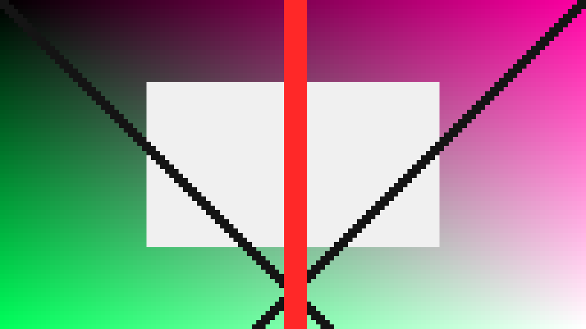
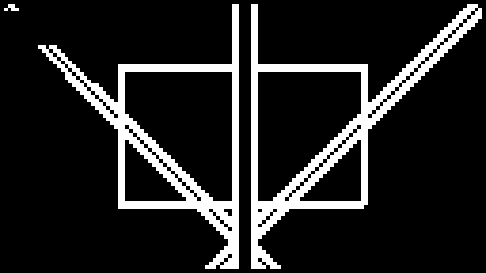
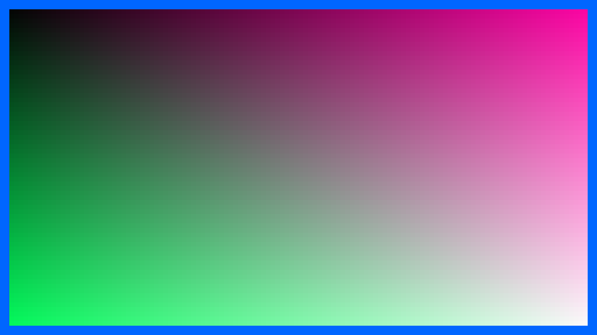
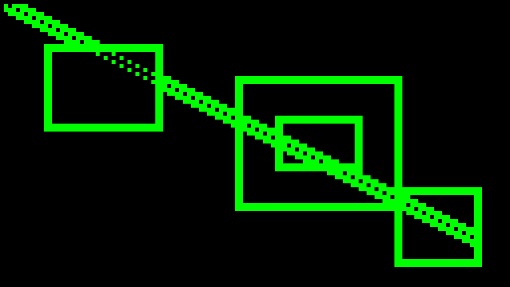
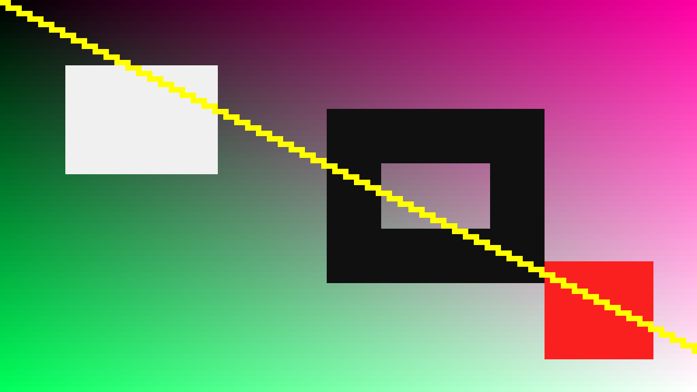
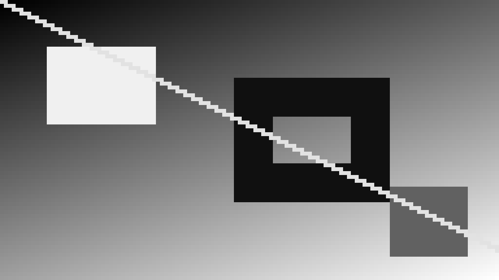
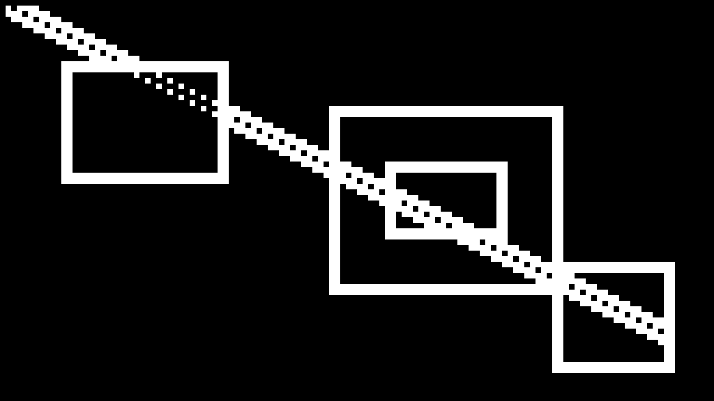
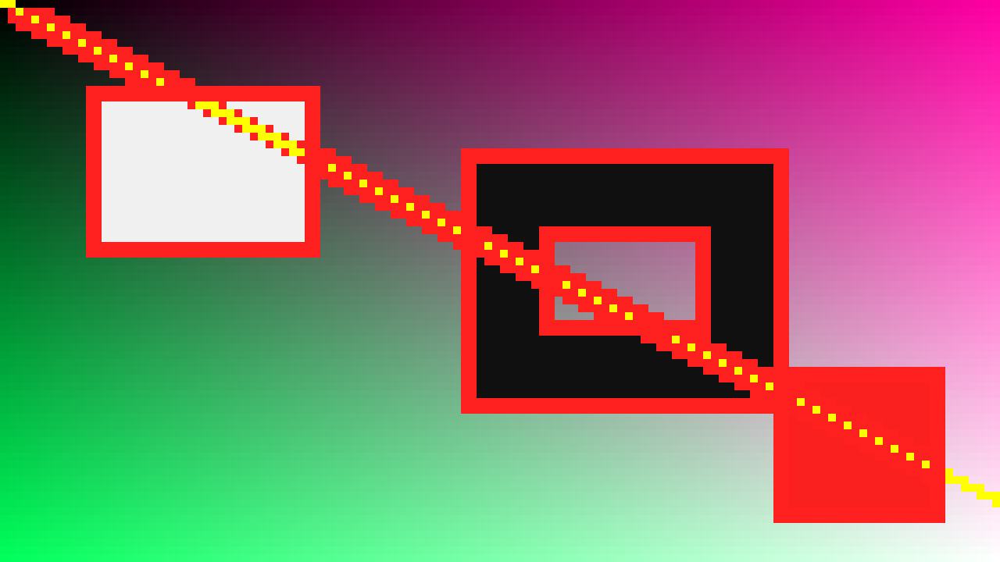
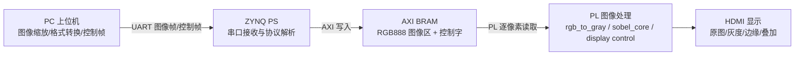

# ZYNQ7020 图像处理课程设计初步实验报告

## 1. 已完成的基础实验列表

本阶段围绕 `sobel_00_rtl_sim` 到 `sobel_05_pc_control_display` 完成了 RTL 仿真、HDMI 显示、UART 传图、PS/PL BRAM 交互、PL Sobel 和上位机控制显示模式等基础链路验证。各实验完成情况如下表。

| 序号 | 实验目录 | 实验内容 | 当前完成情况 | 第一周小扩展或增强点 |
| --- | --- | --- | --- | --- |
| 0 | `sobel_00_rtl_sim` | RTL 级 UART 输入、灰度转换、Sobel 输出仿真 | ModelSim 仿真通过，生成输入图、输出图和关键波形 | testbench 覆盖错误帧头、错误格式、错误行号和合法帧自检 |
| 1 | `sobel_01_hdmi_pattern` | HDMI 固定图显示 | XSim、实现、bitstream 通过，现场 HDMI 照片已整理 | 有效图像四周增加 16 像素蓝色边框 |
| 2 | `sobel_02_hdmi_sobel` | 固定图像 PL Sobel 后 HDMI 显示 | XSim、实现、bitstream 通过，现场 Sobel 照片已整理 | 增加阈值对比，验证 40/80/120 阈值下白色边缘像素单调减少 |
| 3 | `sobel_03_uart_hdmi` | PC UART 传图，PS 写 BRAM，PL HDMI 显示原图 | 协同仿真、协议自检、实现通过，现场原图显示照片已整理 | HDMI 有效显示区域增加可配置蓝色边框 |
| 4 | `sobel_04_uart_sobel_hdmi` | PC UART 输入图像，PL Sobel，HDMI 显示边缘 | 协同仿真、XSim、实现通过，现场 Sobel 显示照片已整理 | 彩色边缘标记，默认绿色边缘，支持阈值对比 |
| 5 | `sobel_05_pc_control_display` | 上位机控制原图、灰度、边缘、叠加模式 | 协同仿真、显示控制模型、实现通过，现场多模式照片已整理 | 控制帧支持模式、阈值和叠加开关 |

## 2. 各基础实验和第一周小扩展的实验现象

### 2.1 实验 0：RTL 仿真

实验 0 使用 `input_rgb.hex` 作为 128x72 RGB888 输入图像，经 UART 字节流模型送入 `uart_rx` 和 `image_frame_rx`，再经过 `rgb_to_gray` 与 `sobel_core` 生成边缘图像。仿真结束时输出 `Sobel RGB888 simulation passed`，有效输出像素为 9216 个，Sobel 输出中非零像素数为 6980，最大值为 255。

输入 RGB 图像如下。


Sobel 仿真输出如下。


关键波形中可以看到 `frame_start`、`rgb_valid`、`gray_valid`、`edge_valid` 和 `video_frame_done` 的先后关系，说明图像帧解析、灰度转换、Sobel 输出和帧结束标志均正常。


### 2.2 实验 1：HDMI 固定图显示

实验 1 验证纯 PL HDMI 输出链路。工程读取 128x72 的固定图像 ROM，并将每个源像素放大为 10x10 像素块，最终在 HDMI 显示器上输出 1280x720 画面。小扩展是在有效图像区域周围增加蓝色边框，用于确认 HDMI 有效显示区域和坐标映射。

预期显示图如下。



现场 HDMI 显示照片如下。


远程构建结果显示 bitstream 生成通过，时序 WNS 为 `7.772 ns`，TNS 为 `0 ns`，资源约为 232 LUT、179 FF、12 BRAM、1 MMCM、8 OSERDES。

### 2.3 实验 2：HDMI 固定图 Sobel 显示

实验 2 在实验 1 的 HDMI 显示基础上加入灰度转换和 Sobel 边缘检测。固定 ROM 图像先转换为灰度，再由 `sobel_core` 计算边缘强度，最后根据阈值输出黑白二值边缘图。

默认阈值 80 的预期 HDMI 输出如下。



现场 HDMI Sobel 照片如下。


第一周小扩展为阈值对比。仿真统计中阈值从 40、80 到 120 逐渐升高时，白色边缘像素数分别为 1307、1274、1234，符合阈值升高后边缘像素数量单调不增加的预期。

| 阈值 | 白色源像素数 | 现象 |
| ---: | ---: | --- |
| 40 | 1307 | 边缘较密，细弱边缘保留更多 |
| 80 | 1274 | 默认效果，边缘较稳定 |
| 120 | 1234 | 边缘更稀疏，弱边缘被抑制 |

### 2.4 实验 3：UART 传图并 HDMI 显示原图

实验 3 引入 ZYNQ PS 和 AXI BRAM。PC 端上位机将图像缩放为 128x72 RGB888 后按 UART 帧格式发送；PS 程序接收并解析帧数据，将像素写入 BRAM；PL 侧从 BRAM 读取像素并通过 HDMI 显示原图。

实验 3 的数据流为：

```text
PC 上位机 -> UART -> ZYNQ PS -> AXI BRAM -> PL HDMI 显示
```

小扩展为在 `hdmi_bram_display.v` 中增加可配置边框参数，默认 `BORDER_WIDTH=20`、`BORDER_COLOR=24'h0066ff`。边框只叠加在 HDMI 显示区域，不改变 BRAM 中的图像数据。

预期 HDMI 原图显示如下。



现场 UART 原图显示照片如下，图中蓝色边框用于说明扩展显示区域已经生效。


### 2.5 实验 4：UART 输入图像的 PL Sobel 显示

实验 4 在实验 3 的 UART、PS、BRAM 和 HDMI 链路基础上继续加入 PL Sobel。PS 仍负责把 PC 发送的 RGB888 图像写入 BRAM，PL 读取 BRAM 后完成灰度转换、Sobel 运算和 HDMI 输出。

默认显示采用绿色边缘、黑色背景，阈值为 80。预期显示结果如下。



现场 HDMI 显示照片如下。


小扩展为彩色边缘标记和阈值对比。阈值 40、80、120 下边缘像素数为 1139、1109、1093，阈值升高后边缘数量减少，符合预期。现场还保存了自然图像和强边缘图像的显示照片。


### 2.6 实验 5：上位机控制显示模式

实验 5 在实验 4 基础上增加上位机控制帧。PC 端除了发送图像帧，还可以发送 `A5 5A cmd value` 控制帧，控制 PS 写入 BRAM 后部的控制字。PL 根据控制字切换显示模式、阈值和叠加开关。

支持的显示模式如下：

| mode | 显示内容 |
| ---: | --- |
| 0 | 原图 |
| 1 | 灰度图 |
| 2 | Sobel 二值边缘图 |
| 3 | 原图 + 红色边缘叠加 |

四种模式预期图如下。









现场多模式照片如下。


实验 5 的小扩展主要体现在控制协议和显示模式上：可以通过 PC 端选择原图、灰度、边缘和叠加模式，也可以调整 Sobel 阈值。协同仿真中 mode=0/1/2/3、阈值 40/80/120、overlay=0/1 等配置均完成全分辨率渲染比对。

## 3. 系统总体框图和数据流说明

系统整体可以分为 PC 上位机、ZYNQ PS、共享 BRAM、PL 图像处理和 HDMI 输出五个部分。实验 0 到实验 5 是逐步增加模块和数据通路的过程：先在纯 RTL 中验证 Sobel 算法，再验证 HDMI 输出，之后加入 PS 和 UART，最后加入上位机控制。



各实验的数据流差异如下：

| 实验 | 输入来源 | 处理路径 | 输出 |
| --- | --- | --- | --- |
| 实验 0 | `input_rgb.hex` | UART 模型 -> 帧解析 -> 灰度 -> Sobel | PNG/PGM 输出和波形 |
| 实验 1 | ROM 固定图 | ROM -> HDMI 缩放显示 | HDMI 固定图 |
| 实验 2 | ROM 固定图 | ROM -> 灰度 -> Sobel -> 阈值二值化 | HDMI Sobel 图 |
| 实验 3 | PC UART 图像 | UART -> PS -> BRAM -> PL 读图 | HDMI 原图 |
| 实验 4 | PC UART 图像 | UART -> PS -> BRAM -> PL Sobel | HDMI 彩色边缘图 |
| 实验 5 | PC UART 图像与控制帧 | UART -> PS -> BRAM 图像区/控制字 -> PL 多模式显示 | HDMI 原图/灰度/边缘/叠加 |

## 4. 关键代码和关键模块说明

### 4.1 UART 帧解析与 PS 写 BRAM

实验 3 到实验 5 使用 PC 端 `host_camera_uart` 工具发送图像。图像帧格式为：

```text
frame header: 55 aa width_l width_h height_l height_h 18
line header : 33 cc row_l row_h
pixels      : R G B, repeated 128 times per row
```

`0x18` 表示 RGB888。每帧图像为 128x72，共 9216 个像素，像素数据量为 27648 字节。PS 端 `main.c` 负责等待帧头、解析宽高和格式、逐行接收像素，并将 RGB888 写入 AXI BRAM。实验 5 中 PS 端还解析控制帧，并将 `mode`、`threshold` 和 `overlay` 写入控制字地址。

### 4.2 `rgb_to_gray`

`rgb_to_gray` 将 RGB888 转换为 8 bit 灰度，使用定点近似公式：

```text
gray = (77 * R + 150 * G + 29 * B) >> 8
```

该公式近似 `0.299R + 0.587G + 0.114B`。模块同步传递像素坐标和有效信号，为后级 Sobel 窗口计算提供灰度输入。

### 4.3 `sobel_core`

`sobel_core` 使用两行缓存和 3x3 窗口计算 Sobel 梯度。水平和垂直方向卷积为：

```text
Gx = -p00 + p02 - 2*p10 + 2*p12 - p20 + p22
Gy = -p00 - 2*p01 - p02 + p20 + 2*p21 + p22
```

输出幅值采用 `abs(Gx) + abs(Gy)` 的近似形式，并在超过 255 时饱和。边界像素输出为 0，帧末通过 `edge_frame_done` 或后级 `video_frame_done` 标志一帧处理完成。

### 4.4 HDMI 显示模块

HDMI 显示相关模块负责生成 1280x720 时序、将 128x72 源图像放大为 10x10 像素块，并通过 `rgb2dvi` 输出 TMDS 信号。实验 1 中 `hdmi_image_display.v` 直接显示 ROM 图像；实验 3 中 `hdmi_bram_display.v` 从 BRAM 读取原图；实验 4 和实验 5 中 `hdmi_bram_sobel_display.v` 进一步加入灰度、Sobel、阈值、彩色边缘和叠加显示逻辑。

### 4.5 上位机控制模块

实验 5 的控制帧格式为：

```text
A5 5A cmd value
```

其中 `cmd=1` 控制显示模式，`cmd=2` 控制 Sobel 阈值，`cmd=3` 控制叠加开关。PL 侧读取 BRAM 控制字后，在原图、灰度、边缘和叠加四种输出之间切换。

## 5. 当前未解决的问题

1. 部分证据仍需要二次整理：现场照片已经按实验归档，但报告提交前还需要确认哪些照片最终纳入仓库，避免引用未提交图片导致远端 Markdown 图片失效。
2. 实验 3 到实验 5 的 evidence README 仍保留“完整 Vitis/BSP/ELF 待现场”之类的远程开发边界说明。如果现场已经跑通，需要补充实际 COM 口、测试日期、板卡型号、串口启动日志和 Program Device 截图。
3. 实验 5 的时序裕量相对更紧，记录中 WNS 为 `+0.325 ns`。虽然实现通过，但后续综合扩展继续增加逻辑时需要关注时序收敛。
4. 原始仿真 VCD 和 Vivado 构建目录体积较大，不能直接提交 Git；报告中只引用精简日志、图片和资源/时序摘要。
5. 实验 0 目前主要是默认 RTL 仿真和异常帧自检；如果验收严格要求每个实验都有明确小扩展，可再补一组更换输入图或修改阈值的仿真对比。

## 6. 第二周综合扩展题目和仿真计划

第二周计划选择综合扩展任务 1：基于 `sobel_05_pc_control_display` 的上位机与输入规格扩展。该方向和当前系统衔接最自然，能够复用已经完成的 UART、PS、BRAM、PL Sobel 和 HDMI 多模式显示链路。

计划目标如下：

- 在 PC 端支持更多输入来源，例如单张图片、多张图片目录或视频文件。
- 对不同尺寸输入图像进行统一缩放、裁剪或补边，使其进入 FPGA 时仍满足 128x72 RGB888 或新的固定处理尺寸要求。
- 保持实验 5 的显示控制能力，包括原图、灰度、边缘、叠加和阈值控制。
- 至少使用 2 种不同原始尺寸的图片进行测试，记录缩放策略和输出效果。

仿真和验证计划如下：

| 步骤 | 验证内容 | 预期产物 |
| --- | --- | --- |
| 1 | PC 端图像缩放、裁剪、补边策略验证 | Python 生成的输入预览图和 128x72 RGB888 数据 |
| 2 | UART 图像帧打包自检 | 帧头、行头、像素数量和字节数统计日志 |
| 3 | PS 协议解析模型验证 | 图像区 BRAM 数据与 golden 输入逐像素一致 |
| 4 | PL 显示和 Sobel 渲染仿真 | 原图、灰度、边缘、叠加模式 PNG 对比 |
| 5 | 阈值和 overlay 控制回归 | 不同阈值下边缘像素数统计，overlay 开关对比图 |
| 6 | 上板验证 | HDMI 照片、串口日志、资源利用率、时序报告 |

第二周扩展完成后，最终报告中将补充修改文件列表、关键代码说明、仿真截图、上板照片、资源利用率和时序结果。

## 7. 小结

目前基础实验已经形成从纯 RTL 仿真到上位机控制 HDMI 显示的完整链路。实验 0 验证了 Sobel 算法数据通路，实验 1 和实验 2 验证了 HDMI 与固定图 Sobel，实验 3 到实验 5 逐步加入 UART、PS、BRAM、PL Sobel 和 PC 控制。第一周小扩展主要集中在显示边框、阈值对比、彩色边缘和显示模式控制上。下一阶段将围绕输入规格扩展继续做仿真和上板验证。
