# ZYNQ7020 图像处理课程设计最终报告

## 1. 课程设计任务说明

本课程设计以黑金 ZYNQ7020 开发板为平台，完成一个由浅入深的 FPGA 图像处理系统。系统从 RTL 级 Sobel 仿真开始，逐步完成 HDMI 固定图显示、固定图 Sobel、PC 串口传图、PS 写入 AXI BRAM、PL 读取 BRAM 并 HDMI 显示、UART 输入图像 Sobel 显示，以及上位机命令控制显示模式。

根据老师原仓库要求，基础任务包括：

1. 完成 `sobel_00_rtl_sim` RTL 仿真，说明输入图像、输出边缘图和关键波形。
2. 完成 `sobel_01_hdmi_pattern` HDMI 固定图片显示，验证 HDMI 输出链路。
3. 完成 `sobel_02_hdmi_sobel` 固定图片 Sobel 显示，说明灰度转换和 Sobel 数据流。
4. 完成 `sobel_03_uart_hdmi` SDK 程序下载和运行，通过串口接收 PC 发送图像并写入 BRAM。
5. 使用 `host_camera_uart` 中的 GUI 或命令行脚本发送图像到 ZYNQ。
6. 完成 `sobel_04_uart_sobel_hdmi`，在 HDMI 上显示 UART 输入图像的 Sobel 边缘结果。
7. 完成 `sobel_05_pc_control_display`，通过 PC 控制 HDMI 显示模式、Sobel 阈值和边缘叠加。
8. 实验 0 到实验 4 每个实验至少完成 1 个基础扩展；实验 5 完成上位机控制显示能力。
9. 保存上板现象照片、串口输出、Vivado 资源利用率、时序和 DRC 结果。

第二周综合扩展选择老师给出的“综合扩展任务 1：基于 `sobel_05` 的上位机与输入规格扩展”。本设计采用方案 A：所有输入尺寸在 PC 上位机统一映射为固定 `128×72 RGB888` 帧，保持 PS/PL/BRAM/HDMI 硬件链路不变。

## 2. 系统总体结构和数据流

系统整体分为 PC 上位机、ZYNQ PS、AXI BRAM、PL 图像处理和 HDMI 输出五个部分。

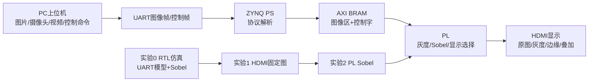
```mermaid
flowchart LR
    sim["实验0 RTL仿真\nUART模型+Sobel"] --> hdmi["实验1 HDMI固定图"]
    hdmi --> sobel["实验2 PL Sobel"]
    pc["PC上位机\n图片/摄像头/视频/控制命令"] --> uart["UART图像帧/控制帧"]
    uart --> ps["ZYNQ PS\n协议解析"]
    ps --> bram["AXI BRAM\n图像区+控制字"]
    bram --> pl["PL\n灰度/Sobel/显示选择"]
    pl --> out["HDMI显示\n原图/灰度/边缘/叠加"]
    sobel --> pl
```

基础数据流如下：

| 实验 | 输入来源 | 主要处理路径 | 输出现象 |
| --- | --- | --- | --- |
| 实验 0 | `input_rgb.hex` | UART 模型 -> 帧解析 -> `rgb_to_gray` -> `sobel_core` | PNG/PGM 边缘图和关键波形 |
| 实验 1 | ROM 固定图 | ROM -> HDMI 时序 -> `rgb2dvi` | HDMI 固定图放大显示 |
| 实验 2 | ROM 固定图 | ROM -> 灰度 -> Sobel -> 阈值二值化 | HDMI 黑白边缘图 |
| 实验 3 | PC UART 图像 | PC -> UART -> PS -> BRAM -> PL 读图 | HDMI 原图显示 |
| 实验 4 | PC UART 图像 | PC -> UART -> PS -> BRAM -> PL Sobel | HDMI 彩色边缘图 |
| 实验 5 | PC 图像 + 控制帧 | PC 控制 -> PS 控制字 -> PL 显示模式选择 | 原图/灰度/边缘/叠加切换 |
| 综合扩展 | 任意尺寸图片/目录/视频 | PC 端缩放、裁剪或补边 -> 固定 128×72 帧 | 不改硬件，扩展输入规格 |

UART 图像帧保持 RGB888 协议：

```text
frame header: 55 aa width_l width_h height_l height_h 18
line header : 33 cc row_l row_h
pixels      : R G B, repeated 128 times per row
```

实验 5 控制帧格式为：

```text
A5 5A cmd value
cmd=1: mode, cmd=2: threshold, cmd=3: overlay
```

## 3. 基础实验复现过程

### 3.1 实验 0：RTL 仿真

实验 0 完成纯 RTL 仿真，验证 UART 帧解析、RGB 转灰度、Sobel 边缘检测和输出帧完成信号。ModelSim 仿真输出 `Sobel RGB888 simulation passed`，有效像素数为 `128×72=9216`，Sobel 输出非零像素 6980 个，最大值 255。


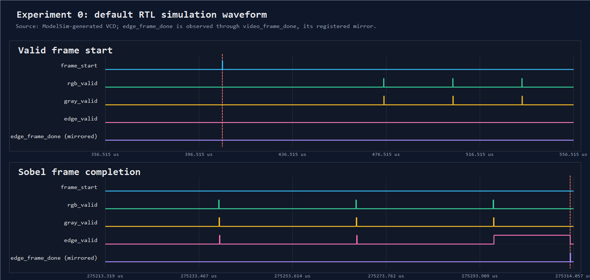

### 3.2 实验 1：HDMI 固定图显示

实验 1 验证 HDMI 输出链路，固定 `128×72` 图像放大为 `1280×720` 显示。现场照片显示 HDMI 输出稳定，蓝色边框用于标记有效显示区域。

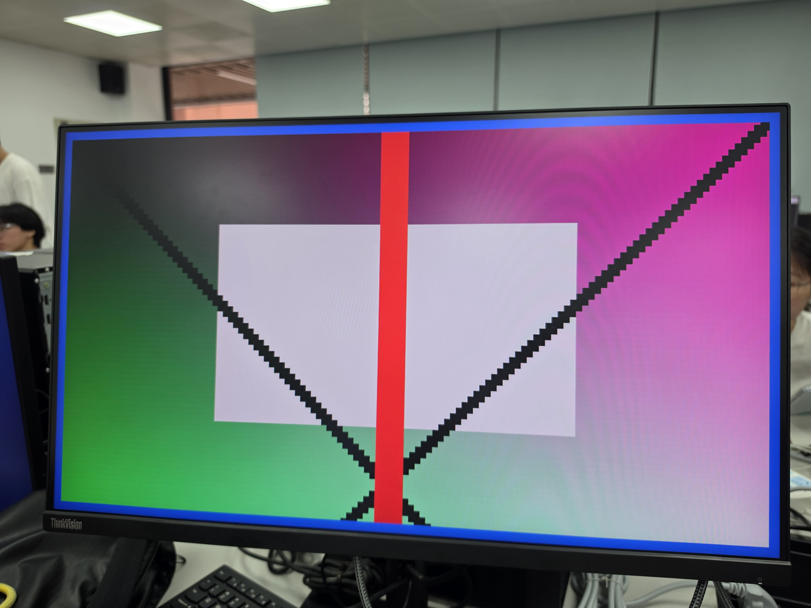

### 3.3 实验 2：固定图 Sobel HDMI 显示

实验 2 在固定图显示基础上加入灰度转换和 Sobel 运算，默认阈值为 80，HDMI 显示黑白边缘图。

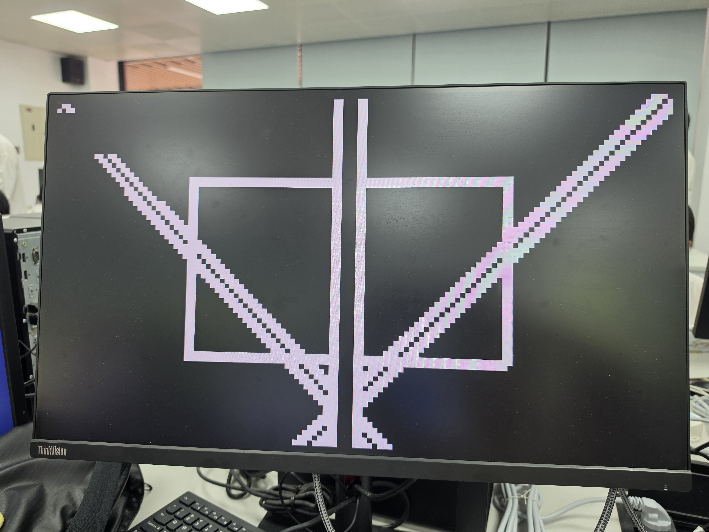

阈值 40、80、120 的白色边缘像素统计分别为 1307、1274、1234，阈值升高后边缘点数量单调减少。

### 3.4 实验 3：UART 传图并 HDMI 显示原图

实验 3 使用 PC 端工具发送图像，PS 解析 UART 帧并写入 BRAM，PL 读取 BRAM 后 HDMI 显示原图。本实验验证了 PC、UART、PS、AXI BRAM 和 PL HDMI 的基础闭环。

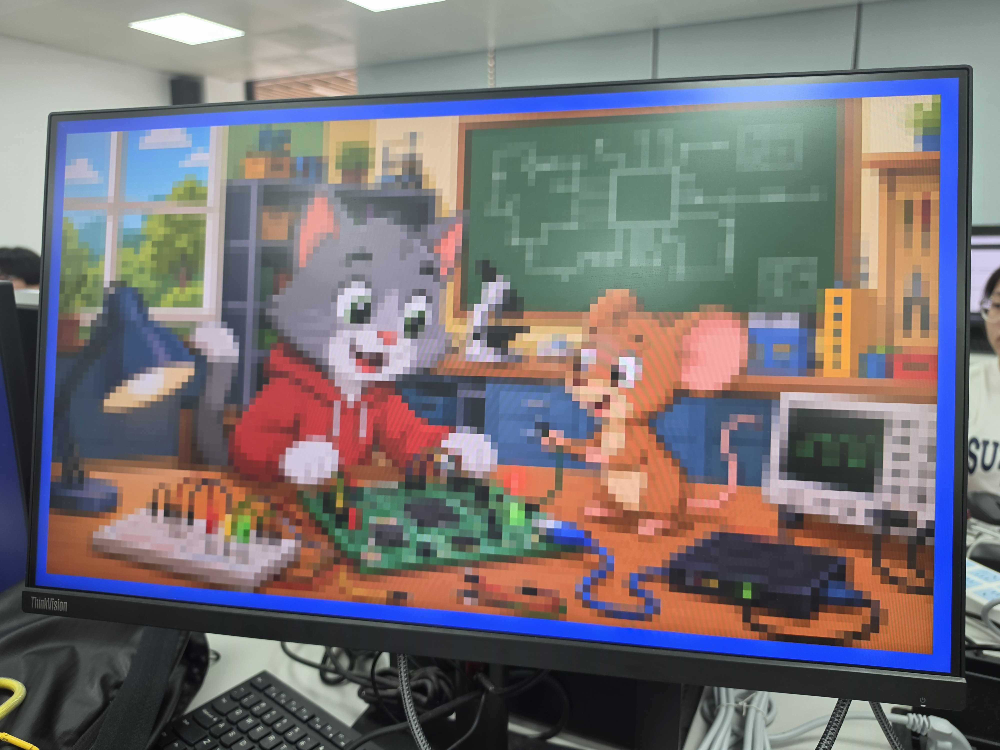

### 3.5 实验 4：UART 输入图像 Sobel 显示

实验 4 在实验 3 基础上加入 PL Sobel，默认绿色边缘、黑色背景，支持阈值对比和不同输入图像测试。

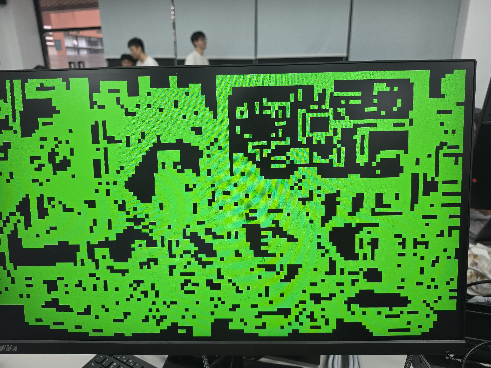

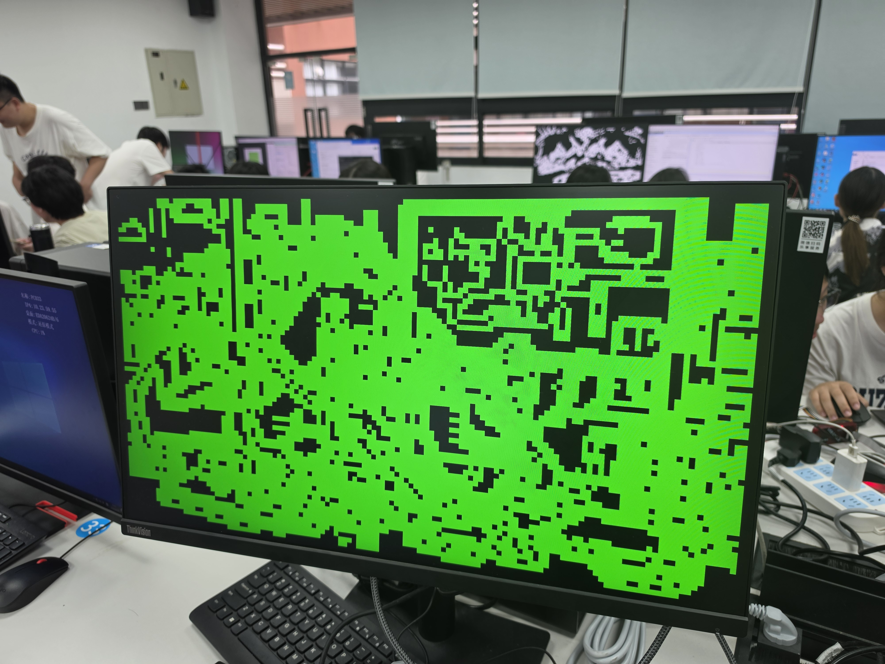

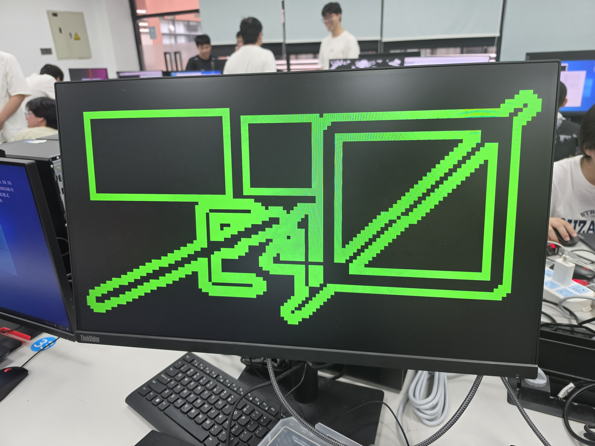

### 3.6 实验 5：上位机控制显示模式

实验 5 增加 PC 控制帧，支持原图、灰度、Sobel 边缘、红色边缘叠加等显示模式，并支持阈值调整。

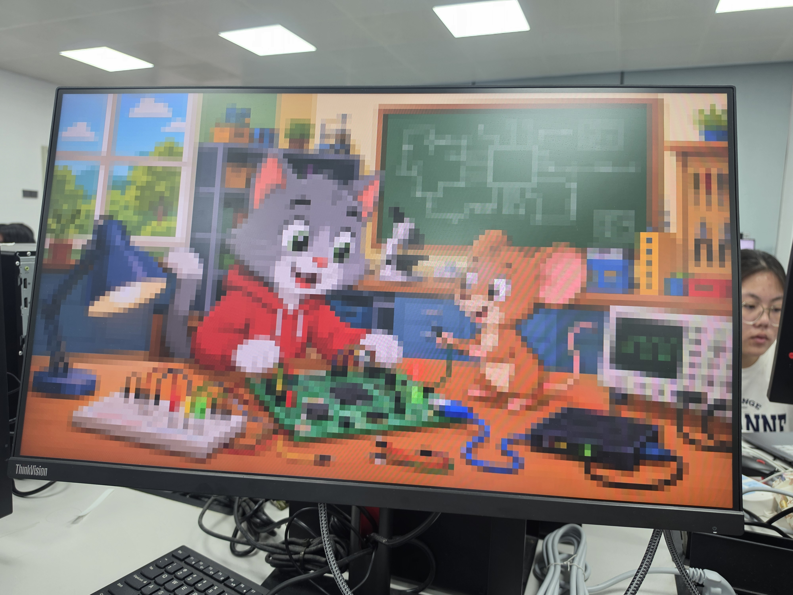

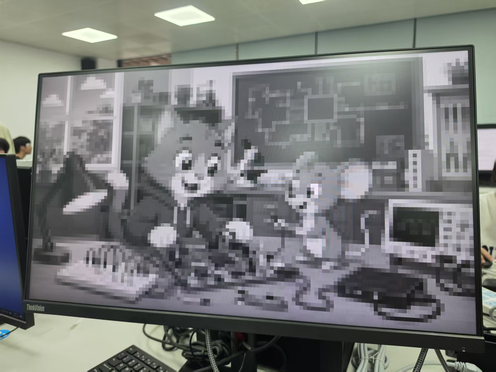

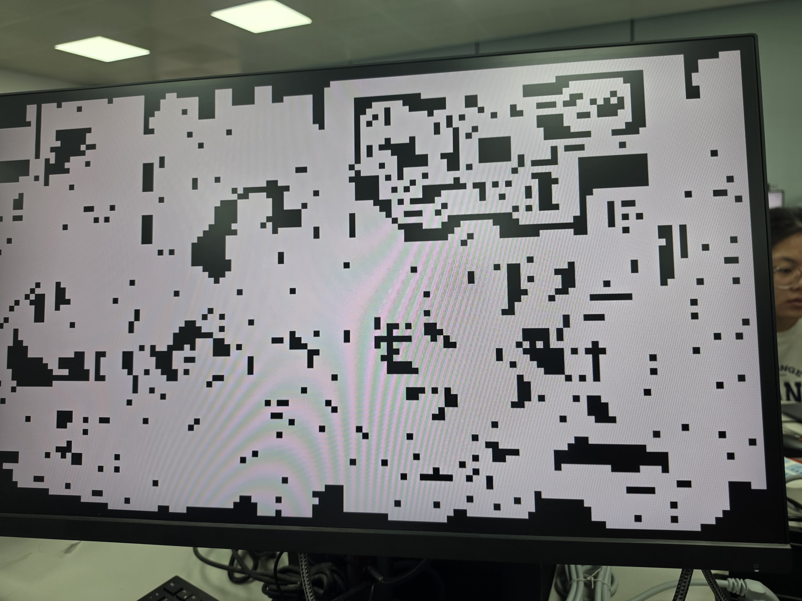


## 4. 第一周基础扩展完成情况

| 实验 | 基础扩展 | 完成现象 |
| --- | --- | --- |
| 实验 0 | 异常帧自检 | testbench 覆盖错误帧头、错误格式、错误行号和合法 RGB888 帧 |
| 实验 1 | HDMI 有效区域边框 | 固定图周围增加蓝色边框，确认显示区域和坐标映射 |
| 实验 2 | Sobel 阈值对比 | 阈值 40/80/120 下边缘像素单调减少 |
| 实验 3 | 原图显示边框 | `hdmi_bram_display.v` 增加 `BORDER_WIDTH` 和 `BORDER_COLOR`，蓝色边框不修改 BRAM 图像数据 |
| 实验 4 | 彩色边缘和阈值对比 | 默认绿色边缘，阈值 40/80/120 下边缘数量单调减少 |
| 实验 5 | 上位机控制显示 | PC 控制原图、灰度、边缘、叠加、阈值和 overlay |

实验 1 的另一组现场现象如下，显示渐变和彩条画面可用于说明 HDMI 输出稳定性。

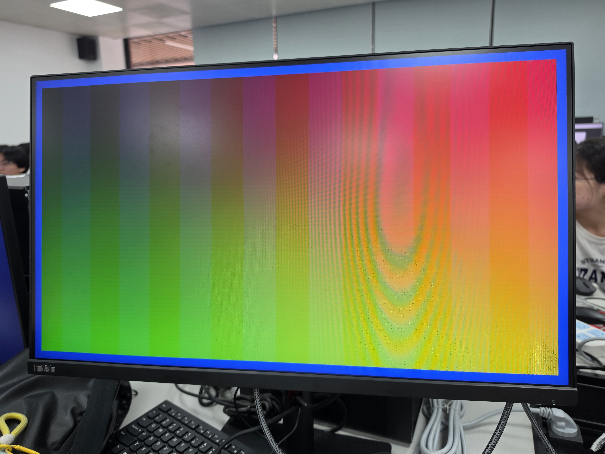

## 5. 修改文件和关键代码说明

### 5.1 基础实验关键模块

| 模块或文件 | 所在实验 | 功能 |
| --- | --- | --- |
| `rgb_to_gray.v` | 实验 0、2、4、5 | 使用 `(77R+150G+29B)>>8` 完成 RGB888 到灰度转换 |
| `sobel_core.v` | 实验 0、2、4、5 | 使用 3×3 窗口和两行缓存计算 Sobel 梯度，输出 8 bit 边缘强度 |
| `image_frame_rx.v` | 实验 0 | RTL 仿真中解析 UART 图像帧和行头 |
| `hdmi_image_display.v` | 实验 1、2 | 生成 HDMI 有效区域图像并完成 10×放大显示 |
| `hdmi_bram_display.v` | 实验 3、5 | 从 BRAM 读取 RGB888 原图并输出 HDMI |
| `hdmi_bram_sobel_display.v` | 实验 4、5 | 从 BRAM 读取图像后完成灰度、Sobel、阈值、颜色映射和显示模式选择 |
| `main.c` | 实验 3、4、5 | PS 端解析 UART 图像帧/控制帧，写入 BRAM 图像区和控制字 |
| `camera_uart_sender.py` / `camera_uart_gui.py` | PC 工具 | 读取图片/摄像头/视频并发送 RGB888 图像帧和控制帧 |

### 5.2 第二周综合扩展修改文件

第二周综合扩展基于 `exp/05-ext-scaling` 分支完成，重点修改上位机，不修改 PS/PL/Vivado 工程。

| 文件 | 修改内容 |
| --- | --- |
| `host_camera_uart/camera_uart_sender.py` | 新增 `prepare_frame`、`--fit-mode`、`--proc-size`、`--fill-color`；支持 stretch、letterbox、center-crop；保持输出帧固定 `128×72` |
| `host_camera_uart/camera_uart_gui.py` | GUI 增加 `Fit mode`、`Proc size` 下拉框和 `Folder` 图片目录入口；GUI 与 CLI 共用 `prepare_frame` |
| `host_camera_uart/README.md` | 补充输入规格扩展、缩放策略和使用说明 |
| `host_camera_uart/tests/test_prepare_frame.py` | 测试缩放/裁剪/补边策略、输出形状和兼容旧 resize 行为 |
| `host_camera_uart/tests/test_protocol_invariants.py` | 测试图像帧包长、帧头和控制帧字节不变 |
| `coursework/evidence/07_input_scaling_extension/*` | 保存扩展离线验证截图、测试日志和矩阵结果 |

关键实现思想如下：

```text
任意尺寸 BGR 输入
  -> prepare_frame(frame_bgr, width=128, height=72, fit_mode, content_size, fill)
  -> 固定 128×72 RGB888
  -> build_frame_packet
  -> UART 发送给原 sobel_05 链路
```

三种 fit 策略：

| 策略 | 含义 | 适用场景 |
| --- | --- | --- |
| `stretch` | 直接拉伸到 128×72，可能改变宽高比 | 保持旧工具行为，速度简单 |
| `letterbox` | 等比缩放，居中放置，空白处填充颜色 | 保持图像不变形 |
| `center-crop` | 等比放大后居中裁剪，铺满画面 | 无黑边显示，牺牲边缘区域 |

处理尺寸 `--proc-size` 支持 `128x72` 和 `64x36`。选择 `64x36` 时，PC 端先生成更粗的 `64×36` 内容，再最近邻放回固定 `128×72` 发送帧，用于演示输入规格和处理分辨率对画面效果的影响。

## 6. 第二周综合扩展设计原理、仿真结果和上板结果

### 6.1 扩展题目和设计方案

选择综合扩展任务 1：基于 `sobel_05` 的上位机与输入规格扩展。采用方案 A：上位机统一完成尺寸适配，FPGA 接收侧保持固定 `128×72 RGB888`。

这样做的好处是：

1. 不修改 BRAM 地址映射，不改变 PS 接收协议。
2. 不修改 PL Sobel 处理尺寸，不影响 HDMI 放大逻辑。
3. 兼容实验 5 现有显示控制命令，包括原图、灰度、边缘、叠加和阈值控制。
4. 可以快速验证多输入尺寸、多输入来源和不同缩放策略。

### 6.2 离线验证结果

扩展离线测试覆盖 `640×480`、`1920×1080`、`1080×1920` 三种原始尺寸，三种 fit 模式和两种处理尺寸，形成 `3×3×2=18` 组验证。所有输出均为 `(72,128,3)` `uint8`，打包后帧长均为 `27943` 字节，帧头均为 `55 aa 80 00 48 00 18`。

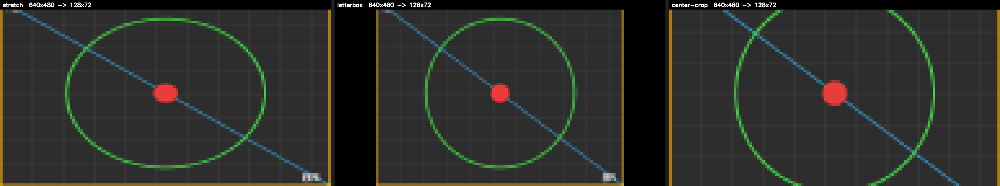

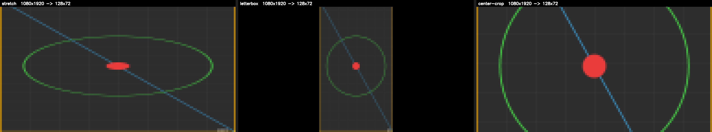

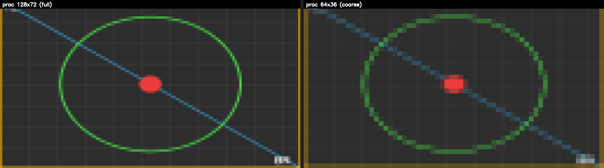

离线测试结果：

```text
tests/test_prepare_frame.py: 7/7 passed
tests/test_protocol_invariants.py: 4/4 passed
summary: 11/11 offline assertions passed
```

验证结论：

- `stretch` 与旧工具的 `cv2.resize + BGR->RGB` 结果兼容。
- `letterbox` 能保持原图宽高比，并用指定颜色填充空白区域。
- `center-crop` 能铺满输出画面，不引入黑边。
- `64×36` 处理尺寸输出呈现更粗的块状效果，但 UART 帧长和帧头不变。
- 控制帧仍为 `A5 5A cmd value`，不影响实验 5 的显示控制功能。

### 6.3 上板结果和最终演示截图

综合扩展的硬件侧复用实验 5 的 bitstream 与 PS 程序。由于扩展不修改 FPGA 处理尺寸，现场上板重点验证输入源、显示模式和阈值控制是否仍能稳定工作。

最终演示照片如下。

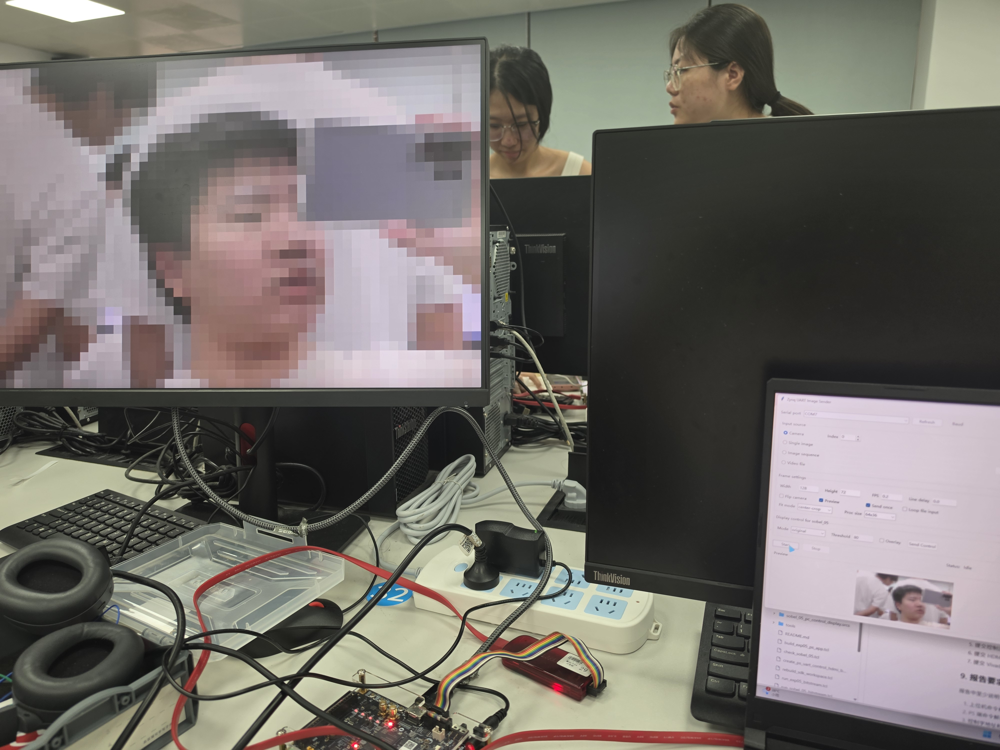

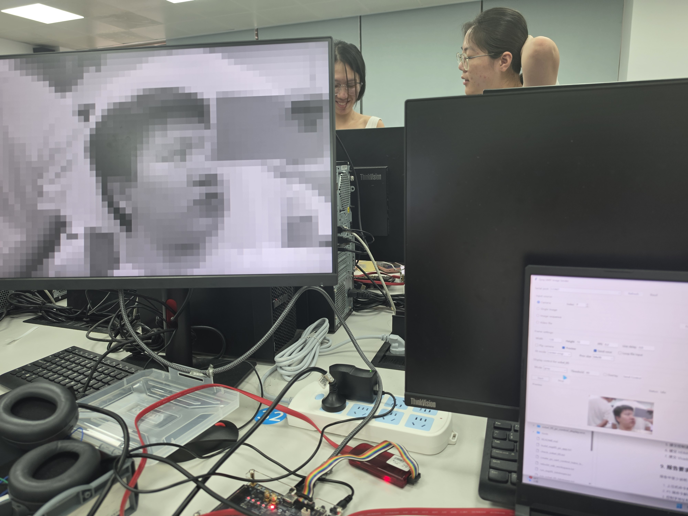

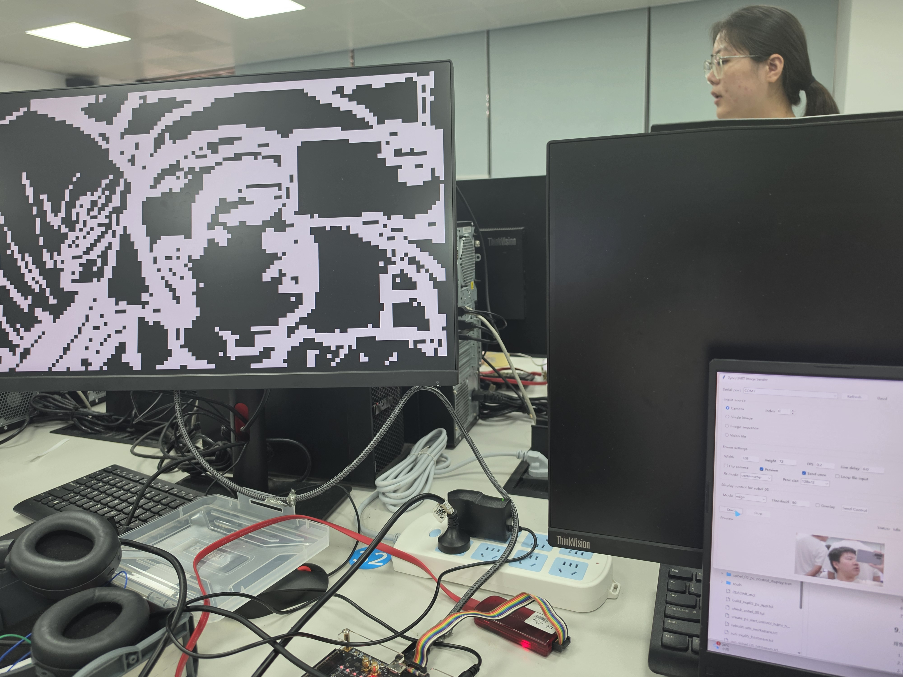

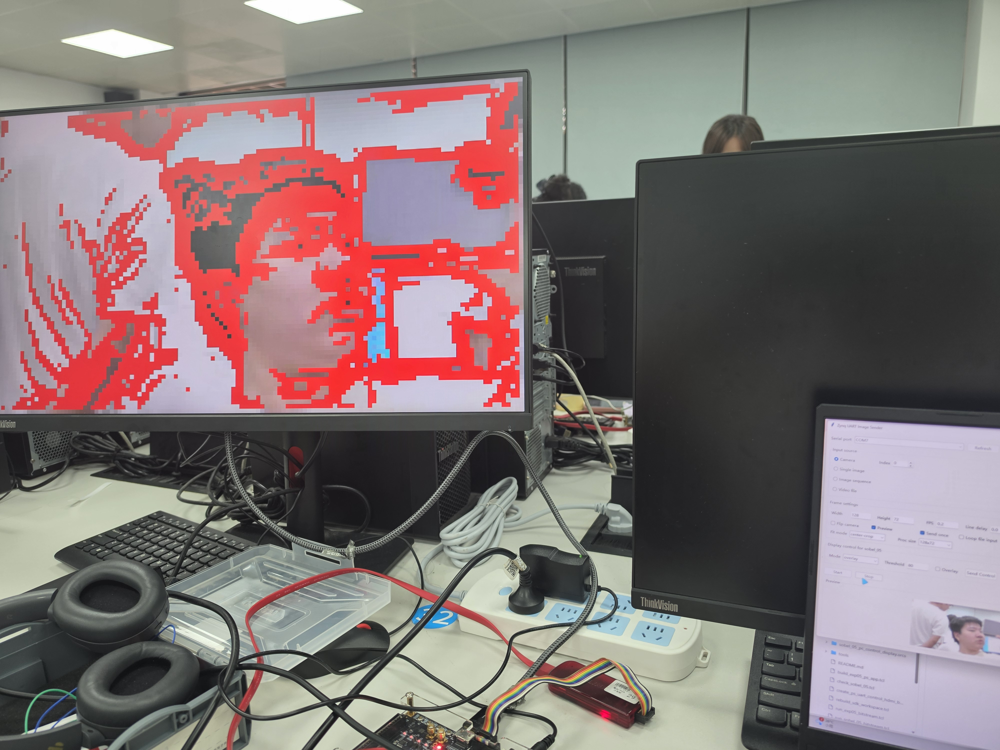

阈值 120 下的最终演示结果如下。

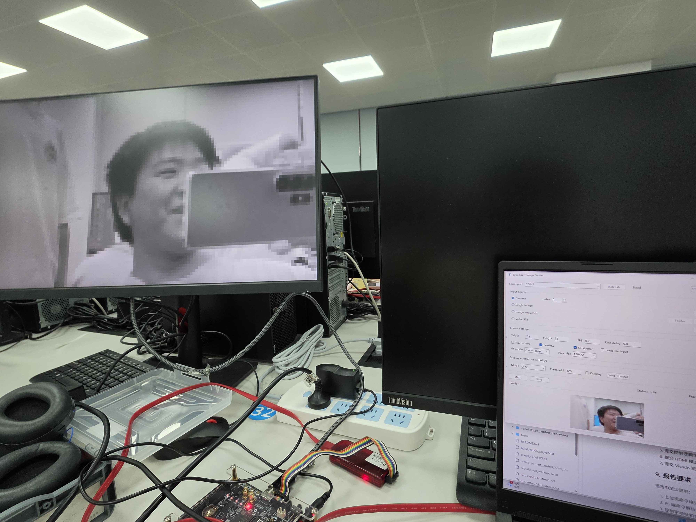

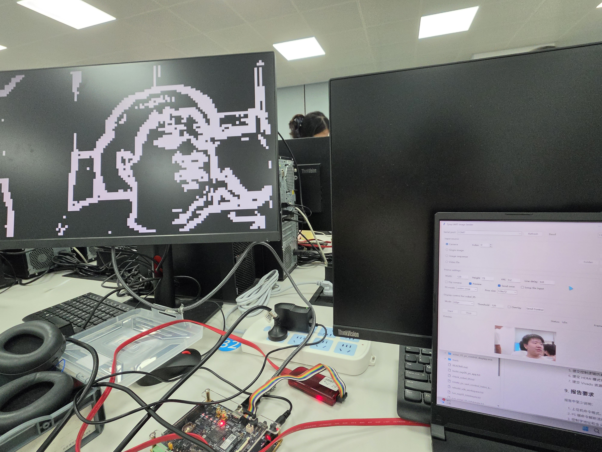

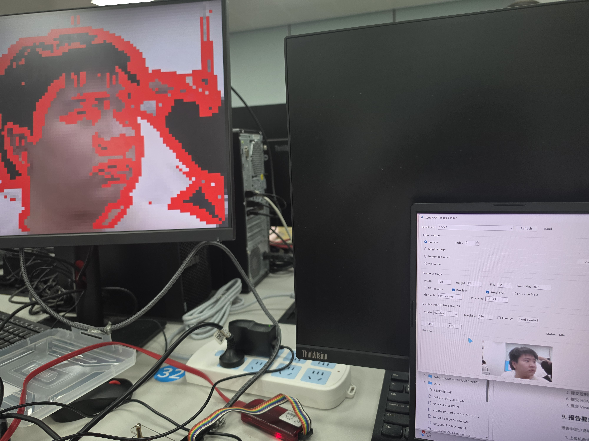

## 7. 资源利用率、时序结果和性能分析

### 7.1 Vivado 资源与时序汇总

| 实验 | LUT | FF | BRAM | DSP | WNS(ns) | TNS(ns) | DRC | 说明 |
| --- | ---: | ---: | ---: | ---: | ---: | ---: | --- | --- |
| 实验 1 HDMI 固定图 | 232 | 179 | 12 | 0 | +7.772 | 0 | 0 error, 1 warning | 纯 PL HDMI，ZPS7-1 warning 符合预期 |
| 实验 2 HDMI Sobel | 2842 | 2353 | 14 | 0 | +1.578 | 0 | 0 error, 1 warning | 加入灰度、Sobel 和阈值二值化 |
| 实验 3 UART HDMI | 1775 | 1504 | 16 | 0 | +8.173 | 0 | 0 violations | 加入 PS/AXI BRAM 和 HDMI 原图显示 |
| 实验 4 UART Sobel | 4446 | 3662 | 18 | 0 | +13.453 | 0 | 0 errors | 加入 BRAM 图像 Sobel 和绿色边缘映射 |
| 实验 5 PC 控制显示 | 10795 | 4113 | 20 | 0 | +0.325 | 0 | 0 violations | 加入显示模式、阈值、叠加控制 |
| 第二周输入规格扩展 | 同实验 5 | 同实验 5 | 同实验 5 | 同实验 5 | 同实验 5 | 0 | 同实验 5 | 只改 PC 上位机，不改 PS/PL/Vivado 工程 |

从资源增长趋势看，实验 1 的资源主要用于 HDMI 时序、ROM/BRAM 和 TMDS 输出；实验 2、4、5 随着 Sobel、BRAM、显示控制和多模式叠加增加，LUT 和 FF 明显上升。实验 5 WNS 为 `+0.325 ns`，仍满足时序，但裕量最小，后续若继续加入 PL 算法需要优先关注时序收敛。

### 7.2 性能分析

图像固定为 `128×72 RGB888` 时，每帧协议层字节数为：

```text
frame header 7B + line header 72×4B + pixel 128×72×3B
= 7 + 288 + 27648
= 27943B
```

若使用 UART 8N1 和 `115200` baud，理论传输时间约为：

```text
27943B × 10bit / 115200 ≈ 2.43s/frame
```

因此本系统的瓶颈主要在 UART 传输带宽，而不是 PL Sobel 本身。实验 5 和第二周扩展通过 PC 端预处理保持传输帧固定，可以避免硬件修改带来的时序风险，但不能突破 UART 带宽限制。若要提升实时性，后续可以考虑老师给出的网络传输扩展方向，使用 UDP/TCP 替代 UART。

## 8. 问题记录与总结

### 8.1 问题记录

| 问题 | 现象 | 解决或处理 |
| --- | --- | --- |
| RTL 仿真工具差异 | 本机未检测到 Icarus/VVP | 使用 ModelSim 完成仿真，并用 XSim 入口交叉验证结果 |
| VCD 文件过大 | 原始波形文件约 127MB，不适合提交 | 提取关键波形 PNG/SVG，报告引用截图 |
| UART 传图速度慢 | `115200` baud 下单帧约 2.43 秒 | 使用低 FPS 或单帧测试；性能分析中明确瓶颈 |
| 实验 5 时序裕量较小 | WNS `+0.325 ns` | 第二周扩展不改 PL，避免继续压缩时序裕量 |
| 输入尺寸多样 | 不同图片比例直接 resize 会变形 | 第二周扩展加入 stretch/letterbox/center-crop 三策略 |
| 硬件尺寸修改风险高 | 改 PL 尺寸需要同步 BRAM、PS、HDMI 和仿真 | 采用 PC 端统一缩放，固定 FPGA 侧 `128×72` 契约 |

### 8.2 总结

本课程设计完成了从 RTL 仿真到 HDMI 上板显示、从固定图像到 PC UART 输入图像、从单一 Sobel 输出到上位机控制显示模式的完整流程。基础实验验证了 RGB888 图像在 Verilog、UART、BRAM、PS/PL 和 HDMI 链路中的表示与传递方式，也验证了灰度转换、Sobel 边缘检测、阈值控制和彩色叠加的硬件实现。

第一周基础扩展完成了 HDMI 边框、Sobel 阈值对比、彩色边缘映射和显示模式控制。第二周综合扩展选择上位机与输入规格扩展，在不修改硬件的前提下支持不同尺寸输入、三种 fit 策略和两种处理尺寸，并通过 11 项离线测试和 18 组矩阵验证保证 UART 帧格式和控制命令不变。最终上板演示能够展示原图、灰度、边缘和叠加模式，说明基础链路和控制链路可用。

后续若继续改进，可以优先考虑两点：一是将 UART 传输升级为网络传输以提升帧率；二是在 PL 中增加新的图像处理算法时同步优化流水线和资源使用，避免实验 5 已经较小的时序裕量继续收紧。
